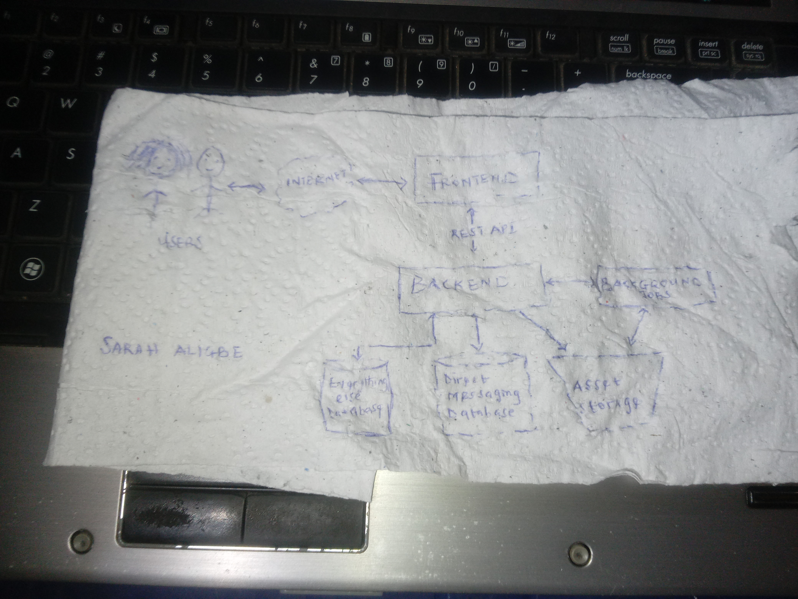
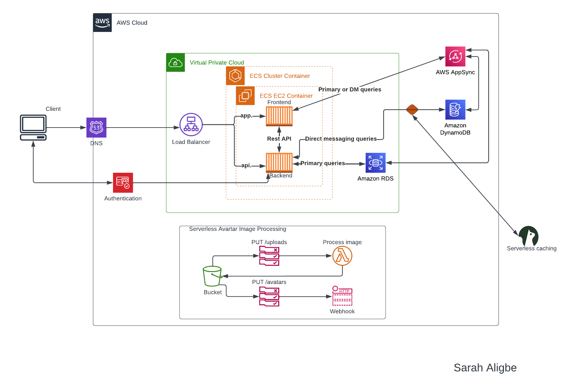
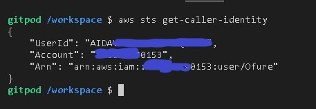
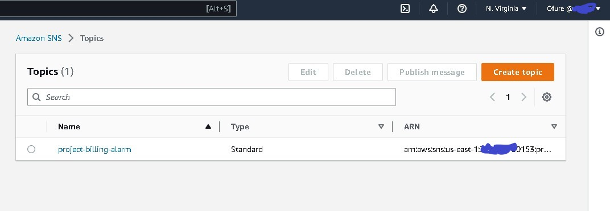
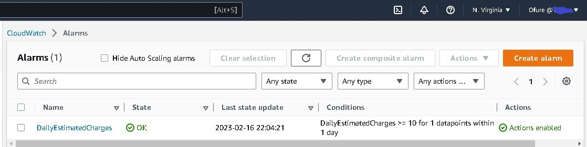
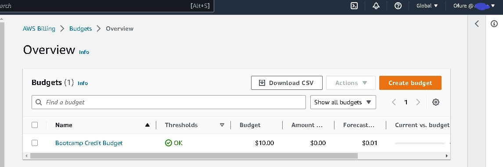

# Week 0 — Billing and Architecture

## Required Tasks
### Recreate the Conceptual Diagram

### Recreate the Logical Architectural Diagram
  
Here is a [Link to the diagram](https://lucid.app/lucidchart/b2f80788-9cd4-4d07-9394-731387c4017a/edit?viewport_loc=218%2C418%2C952%2C415%2C0_0&invitationId=inv_998c0356-185f-4d85-b6d1-ee5e853490de)  

### Install and Verify AWS CLI
I installed AWS CLI in gitpod by adding the code block below to the `.gitpod.yml` file  
```bash
tasks:
  - name: aws-cli
    env:
      AWS_CLI_AUTO_PROMPT: on-partial
    init: |
      cd /workspace
      curl "https://awscli.amazonaws.com/awscli-exe-linux-x86_64.zip" -o "awscliv2.zip"
      unzip awscliv2.zip
      sudo ./aws/install
      cd $THEIA_WORKSPACE_ROOT
```
I set my AWS credentials as ennvironment variables using:
```bash
export AWS_ACCESS_KEY_ID="redacted"
export AWS_SECRET_ACCESS_KEY="redacted"
export AWS_DEFAULT_REGION="us-east-1"
```
I ensured that my environment variables will persist in my gitpod environment by running:
```bash
gp env AWS_ACCESS_KEY_ID="redacted"
gp env AWS_SECRET_ACCESS_KEY="redacted"
gp env AWS_DEFAULT_REGION="us-east-1"
```
To verify that my AWS CLI was installed and correctly configured, I ran:
```bash
aws sts get-caller-identity
```
The output of my command was:  
  

### Create a Billing Alarm
To create a billing alarm, I did the following:
- Logged in to my root account and went to the Billing Page
- Under `Billing Preferences` I Chose `Receive Billing Alerts`, added my email and saved Preferences
- On gitpod, I created an SNS Topic. The SNS Topic will send the notification to my email when I get overbilled
```bash
aws sns create-topic --name project-billing-alarm
```
The command returns a Topic ARN
- I ran the following command to create a subscription
```bash
aws sns subscribe \
    --topic-arn redacted \
    --protocol email \
    --notification-endpoint sarah*******@gmail.com
```
- I checked my email and confirmed my subscription
  
- I created a JSON file for the [alarm metrics](https://github.com/Sarahligbe/aws-bootcamp-cruddur-2023/blob/main/aws/json/alarm-config.json)   
- I ran the following command to create the alarm:
```bash
aws cloudwatch put-metric-alarm --cli-input-json file://aws/json/alarm-config.json
```
  

### Create a Budget
To create the budget, I did the following:
- On gitpod, I got my Account ID by running the following command:
```bash
aws sts get-caller-identity --query Account --output text
```
- I saved the output which was my account ID as an environment variable
```bash
export AWS_ACCOUNT_ID="********0153"
gp env AWS_ACCOUNT_ID="********0153"
```
- I created a [budget.json](https://github.com/Sarahligbe/aws-bootcamp-cruddur-2023/blob/main/aws/json/budget.json) file and a [budget-notification-with-subscribers](https://github.com/Sarahligbe/aws-bootcamp-cruddur-2023/blob/main/aws/json/budget-notification-with-subscribers.json) file
- I ran the following command to create the budget:
```bash
aws budgets create-budget \
    --account-id $AWS_ACCOUNT_ID \
    --budget file://aws/json/budget.json \
    --notifications-with-subscribers file://aws/json/budget-notification-with-subscribers.json
```
  

I did not create a second Budget because I was concerned of budget spending going over the 2 budget free limit.
