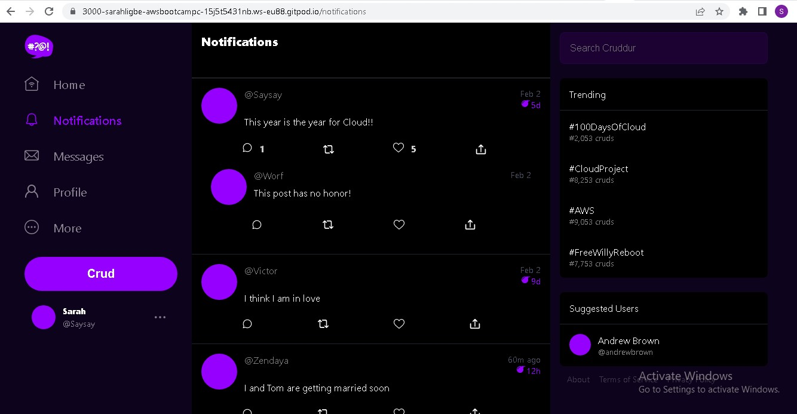

# Week 1 — App Containerization
I already had a working knowledge of Docker so it was easy for me to do this week's tasks.  
I also watched all the video content for the week on the youtube channel.

## Required Tasks
### Containerize Applications
#### Backend DockerFile
Created a DockerFile in the `backend-flask/` directory. You can find the DockerFile [here](https://github.com/Sarahligbe/aws-bootcamp-cruddur-2023/blob/main/backend-flask/Dockerfile).  
#### Frontend DockerFile
Created a DockerFile to containerize the frontend in the `frontend-react-js/` directory. You can find the DockerFile [here](https://github.com/Sarahligbe/aws-bootcamp-cruddur-2023/blob/main/frontend-react-js/Dockerfile).
#### docker-compose file
With the docker-compose file, you can easily manage complex applications that consist of multiple services and containers. You can define the dependencies between your services, specify the resources required for each service, and configure the networking and communication between services.  
You can find the docker-compose file [here](https://github.com/Sarahligbe/aws-bootcamp-cruddur-2023/blob/main/docker-compose.yml)  

I ran the following command to build the images and run the containers
```bash
docker compose up -d --build
```
The command above builds the images first and then runs the containers in detached mode.  
After running the command, I opened the ports in the gitpod environment to be able to visit the URL  
The frontend looks like this:
  
The backend looks like this:
  

### Document the Notification Endpoint for the OpenAPI Document
I created an endpoint for notifications in the `./backend-flask/openapi-3.0.yml` file by adding the following:
```bash
  /api/activities/notifications:
    get:
      description: 'Return a feed of activities for all the people I follow'
      tags:
        - activities
      parameters: []
      responses:
        '200':
          description: Returns an array of activities
          content:
            application/json:
              schema:
                type: array
                items:
                  $ref: '#/components/schemas/Activity'
```

### Write a Flask Backend Endpoint for Notifications
I wrote a Flask backend endpoint for notifications.  
- I added the following to the `./backend-flask/app.py` file:
```bash
@app.route("/api/activities/notifications", methods=['GET'])
def data_notifications():
  data = NotificationsActivities.run()
  return data, 200
```
And
```bash
from services.notifications_activities import *
```
- I then created a `notifications_activities.py` file in the `./backend-flask/services/` directory. You can find the file [here](https://github.com/Sarahligbe/aws-bootcamp-cruddur-2023/blob/main/backend-flask/services/notifications_activities.py)  


### Write a React Page for Notifications
I wrote the frontend React page for notifications.  
- I added the following to the `./frontend-react-js/App.js` file:
```bash
import NotificationsFeedPage from './pages/NotificationsFeedPage';
```
I removed the following:
```bash
import process
```
And added:
```bash
  {
    path: "/notifications",
    element: <NotificationsFeedPage />
  },
```
- I then created a `NotificationsFeedPage.js` and `NotificationsFeedPage.css` file in the `frontend-react-js/src/pages/` directory.  
The `NotificationsFeedPage.js` can be found [here](https://github.com/Sarahligbe/aws-bootcamp-cruddur-2023/blob/main/frontend-react-js/src/pages/NotificationsFeedPage.js)  
The `NotificationsFeedPage.css` can be found [here](https://github.com/Sarahligbe/aws-bootcamp-cruddur-2023/blob/main/frontend-react-js/src/pages/NotificationsFeedPage.css)  
  

### Run DynamoDB Local Container and ensure it works
I added the following to the `docker-compose.yml` file:
```bash
  dynamodb-local:
    # https://stackoverflow.com/questions/67533058/persist-local-dynamodb-data-in-volumes-lack-permission-unable-to-open-databa
    # We needed to add user:root to get this working.
    user: root
    command: "-jar DynamoDBLocal.jar -sharedDb -dbPath ./data"
    image: "amazon/dynamodb-local:latest"
    container_name: dynamodb-local
    ports:
      - "8000:8000"
    volumes:
      - "./docker/dynamodb:/home/dynamodblocal/data"
    working_dir: /home/dynamodblocal
    networks:
      - internal-network
```
Then I ran `docker compose up -d --build` again to build the image and run the container. Then I unlocked the port 8000.

To ensure that it works, 
- I ran the following to create a Table:
```bash
aws dynamodb create-table \
    --endpoint-url http://localhost:8000 \
    --table-name Music \
    --attribute-definitions \
        AttributeName=Artist,AttributeType=S \
        AttributeName=SongTitle,AttributeType=S \
    --key-schema AttributeName=Artist,KeyType=HASH AttributeName=SongTitle,KeyType=RANGE \
    --provisioned-throughput ReadCapacityUnits=1,WriteCapacityUnits=1 \
    --table-class STANDARD
```
- I created an `Item` in the Table:
```bash
aws dynamodb put-item \
    --endpoint-url http://localhost:8000 \
    --table-name Music \
    --item \
        '{"Artist": {"S": "No One You Know"}, "SongTitle": {"S": "Call Me Today"}, "AlbumTitle": {"S": "Somewhat Famous"}}' \
    --return-consumed-capacity TOTAL  
```
- I listed the Table:
```bash
aws dynamodb list-tables --endpoint-url http://localhost:8000
```
- Finally, I queried the items created in the table:
```bash
aws dynamodb scan --table-name cruddur_cruds --query "Items" --endpoint-url http://localhost:8000
```

  

### Run Postgres Container and ensure it works
- I added the following to the `docker-compose.yml` file to create the postgres container:
```bash
  db:
    image: postgres:13-alpine
    restart: always
    environment:
      - POSTGRES_USER=postgres
      - POSTGRES_PASSWORD=password
    ports:
      - '5432:5432'
    volumes: 
      - db:/var/lib/postgresql/data
    networks:
      - internal-network
```
- I created a volume in order to persist the database data:
```bash
volumes:
  db:
    driver: local
```
- I ran `docker compose up -d --build` to build the postgres image and run the container
- I unlocked the port 5432 in the gitpod environment

To ensure it works,
- I installed postgres in the gitpod environment by running the following commands:
```bash
      curl -fsSL https://www.postgresql.org/media/keys/ACCC4CF8.asc|sudo gpg --dearmor -o /etc/apt/trusted.gpg.d/postgresql.gpg
      echo "deb http://apt.postgresql.org/pub/repos/apt/ `lsb_release -cs`-pgdg main" |sudo tee  /etc/apt/sources.list.d/pgdg.list
      sudo apt update
      sudo apt install -y postgresql-client-13 libpq-dev
```
- I ran the following commands to connect to a PostgreSQL database server:
```bash
psql -U postgres --host localhost
```
- Inside PostgreSQL database server, I ran the following to list the databases:
```bash
psql> \l
```  


### Bonus
I added the following to the gitpod.yml file to automatically install npm and postgresql-client whenever I start the environment:
```bash
  - name: npm
    init: |
      cd /frontend-react-js
      npm i
      cd $THEIA_WORKSPACE_ROOT
  - name: postgres
    init: |
      curl -fsSL https://www.postgresql.org/media/keys/ACCC4CF8.asc|sudo gpg --dearmor -o /etc/apt/trusted.gpg.d/postgresql.gpg
      echo "deb http://apt.postgresql.org/pub/repos/apt/ `lsb_release -cs`-pgdg main" |sudo tee  /etc/apt/sources.list.d/pgdg.list
      sudo apt update
      sudo apt install -y postgresql-client-13 libpq-dev
```
