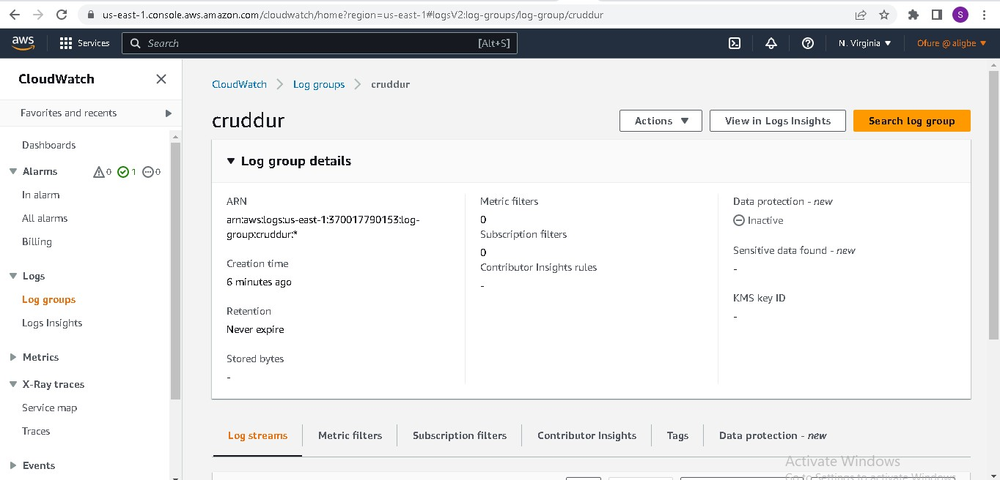
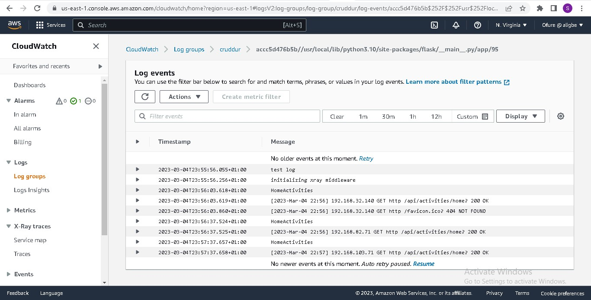

# Week 2 — Distributed Tracing
It was a bit difficult to do this week's tasks because I had no prior knowledge of distributed tracing and I was not in the best state due to the elections held in my country - Nigeria. I managed to complete all the videos in the youtube playlist and watch additional videos to better understand distributed tracing.

## Required tasks
### Instrumenting HoneyComb with OTEL
I already created a honeycomb account in week0 following Shala's youtube video.
Honeycomb.io is a cloud-based observability platform designed for engineers and developers to understand and analyze complex systems and applications. It allows users to collect, explore, and visualize data from various sources, including logs, traces, and metrics, in real-time.

I carried out the following to instrument HoneyComb:
- I created a new environment in HoneyComb called `aws-bootcamp-cruddur`.  
An environment refers to a set of configurations and settings that define how your application or system behaves in different contexts. Environments are used to manage the various stages of your application's lifecycle, such as development, staging, and production, and to separate data and resources across these stages.
Each environment in Honeycomb can have its own datasets, API keys, integrations, and other settings that are specific to that environment.
- I copied the API key from my newly created environment and saved it in my gitpod environment as an environment variable
```bash
export HONEYCOMB_API_KEY="myapikey"
gp env HONEYCOMB_API_KEY="myapikey"
```
- In the `requirements.txt` file I added the following to install Open Telemetry packages to instrument a flask app
```bash
opentelemetry-api 
opentelemetry-sdk 
opentelemetry-exporter-otlp-proto-http 
opentelemetry-instrumentation-flask 
opentelemetry-instrumentation-requests
```
And then I changed directory to `backend-flask` and installed them with:
```bash
pip install -r requirements.txt
```
- I added the following in my `app.py` file to create and initialize a tracer and Flask instrumentation to send data to Honeycomb
```bash    
from opentelemetry import trace
from opentelemetry.instrumentation.flask import FlaskInstrumentor
from opentelemetry.instrumentation.requests import RequestsInstrumentor
from opentelemetry.exporter.otlp.proto.http.trace_exporter import OTLPSpanExporter
from opentelemetry.sdk.trace import TracerProvider
from opentelemetry.sdk.trace.export import BatchSpanProcessor

# Initialize tracing and an exporter that can send data to Honeycomb
provider = TracerProvider()
processor = BatchSpanProcessor(OTLPSpanExporter())
provider.add_span_processor(processor)
trace.set_tracer_provider(provider)
tracer = trace.get_tracer(__name__)

# Initialize automatic instrumentation with Flask
app = Flask(__name__)
FlaskInstrumentor().instrument_app(app)
RequestsInstrumentor().instrument()
```
- I added the following to configure OpenTelemetry to send events to Honeycomb using environment variables in the `docker-compose.yml` file
```bash
OTEL_EXPORTER_OTLP_ENDPOINT: "https://api.honeycomb.io"
OTEL_EXPORTER_OTLP_HEADERS: "x-honeycomb-team=${HONEYCOMB_API_KEY}"
OTEL_SERVICE_NAME: "backend-flask"
```
${HONEYCOMB_API_KEY} references the API key environment variable that was exported earlier.
- I added spans and attributes. See it [here]()  
A span is a unit of work in a distributed system that represents a single operation or transaction. Spans capture information such as the start time, duration, and outcome of an operation, as well as any events or activities that occurred during the operation. By collecting spans, you can gain visibility into the flow of requests through your system and identify bottlenecks or issues that may be affecting performance.
Attributes are key-value pairs that provide additional context for spans and events. Attributes can be used to capture metadata about the application, such as the version number, hostname, or user ID, as well as specific details about a span, such as the name of the function or the input parameters. By adding attributes to your data, you can better understand the context in which events occurred and make more informed decisions based on the data.


### Instrument AWS X-Ray
AWS X-Ray is a service provided by AWS that allows developers to analyze and debug distributed applications, such as microservices and serverless applications, running on the AWS cloud platform.  
I carried out the following to instrument X-Ray:
- I added the following to the `requirements.txt` file
```bash
aws-xray-sdk
```
I changed directory to `backend-flask` and ran `pip install -r requirements.txt` to install the aws xray sdk
- I added the following to the `app.py` file
```bash
from aws_xray_sdk.core import xray_recorder
from aws_xray_sdk.ext.flask.middleware import XRayMiddleware

xray_url = os.getenv("AWS_XRAY_URL")
xray_recorder.configure(service='backend-flask', dynamic_naming=xray_url)
XRayMiddleware(app, xray_recorder)
```
- I created an `xray.json` file in the `aws/json/` directory and added:
```bash
{
  "SamplingRule": {
      "RuleName": "Cruddur",
      "ResourceARN": "*",
      "Priority": 9000,
      "FixedRate": 0.1,
      "ReservoirSize": 5,
      "ServiceName": "Cruddur",
      "ServiceType": "*",
      "Host": "*",
      "HTTPMethod": "*",
      "URLPath": "*",
      "Version": 1
  }
}
```
- I ran this command to create an X-Ray group:
```bash
aws xray create-group \
   --group-name "Cruddur" \
   --filter-expression "service(\"backend-flask\")"
```


- I ran the following command to create a new sampling rule in AWS X-Ray from the `xray.json`:
```bash
aws xray create-sampling-rule --cli-input-json file://aws/json/xray.json
```


- I added the following to the `docker-compose.yml` file to create the xray daemon
```bash
  xray-daemon:
    image: "amazon/aws-xray-daemon"
    environment:
      AWS_ACCESS_KEY_ID: "${AWS_ACCESS_KEY_ID}"
      AWS_SECRET_ACCESS_KEY: "${AWS_SECRET_ACCESS_KEY}"
      AWS_REGION: "us-east-1"
    command:
      - "xray -o -b xray-daemon:2000"
    ports:
      - 2000:2000/udp
```
The AWS X-Ray daemon is a service that collects trace data from applications, organizes that data into traces, and sends those traces to the X-Ray service for analysis and visualization. The X-Ray daemon is required because it provides a centralized mechanism for collecting and sending trace data. Without the daemon, applications would need to send trace data directly to the X-Ray service, which could be inefficient and difficult to manage in a distributed system with multiple services running on multiple hosts.  
- I added these two env vars to our backend-flask in our `docker-compose.yml` file
```bash
      AWS_XRAY_URL: "*4567-${GITPOD_WORKSPACE_ID}.${GITPOD_WORKSPACE_CLUSTER_HOST}*"
      AWS_XRAY_DAEMON_ADDRESS: "xray-daemon:2000"
```
By setting these environment variables, the service or application running in the container can use the AWS X-Ray SDK to generate trace data and send it to the X-Ray daemon for collection and analysis.
- I ran `docker compose up -d --build` and visited the `api/activities/home` endpoint to generate trace segments in AWS X-Ray
- After I ran the docker compose command, I noticed I wasn't getting any traces in X-Ray, I viewed the logs and realized that in the docker-compose.yml file, I had explicitly defined a custom network that your my will be connected to instead of the default network docker compose creates for the containers, hence the backend container could not connect to the xray daemon container so traces were not collected and sent to the AWS X-Ray service. I fixed the issue by adding
```bash
    networks:
      - internal-network
```
to the xray-daemon container in the `docker-compose.yml` file.


### Instrument AWS X-Ray subsegments
A subsegment is a part of a trace segment that represents a segment of work performed by a downstream service in response to a request from the parent service.
See it in this [commit]().  


### Configure custom logger to send to CloudWatch Logs
CloudWatch Logs allows you to store, monitor, and analyze log files from various systems, applications, and services.  

To configure the custom logger I did the following:
- I added `watchtower` to the `requirements.txt` file and installed it with `pip install -r requirements.txt`
- I added the code below to `app.py`
```bash
import watchtower
import logging
from time import strftime
```
```bash
# Configuring Logger to Use CloudWatch
LOGGER = logging.getLogger(__name__)
LOGGER.setLevel(logging.DEBUG)
console_handler = logging.StreamHandler()
cw_handler = watchtower.CloudWatchLogHandler(log_group='cruddur')
LOGGER.addHandler(console_handler)
LOGGER.addHandler(cw_handler)
LOGGER.info("test log")
```
```bash
@app.after_request
def after_request(response):
    timestamp = strftime('[%Y-%b-%d %H:%M]')
    LOGGER.error('%s %s %s %s %s %s', timestamp, request.remote_addr, request.method, request.scheme, request.full_path, response.status)
    return response
```
- I added the following to `home_activities.py`
```bash
Logger.info("HomeActivities")
```
And initialized it by adding `Logger` to `def run():` in `home_activities.py`, as in:
```bash
def run(Logger):
```
I also added `Logger= LOGGER` in `app.py` 
```bash
@app.route("/api/activities/home", methods=['GET'])
@xray_recorder.capture('activities_home')
def data_home():
  data = HomeActivities.run(Logger= LOGGER) #added it to this line
  return data, 200
```
- I added the following to the docker-compose.yml file to set environment variables
```bash
      AWS_DEFAULT_REGION: "${AWS_DEFAULT_REGION}"
      AWS_ACCESS_KEY_ID: "${AWS_ACCESS_KEY_ID}"
      AWS_SECRET_ACCESS_KEY: "${AWS_SECRET_ACCESS_KEY}"
```
- Finally, I ran `docker-compose up -d --build` 



### Integrate Rollbar and capture an error
Rollbar is an error monitoring and debugging tool for software applications. It provides a platform for developers to track and analyze errors and exceptions that occur in their applications, and provides tools for debugging and resolving those errors.  

To integrate rollbar, I did the following:
- I logged into [rollbar.com](rollbar.com) and created a new project called `Cruddur`
- I added the following to my `requirements.txt` file
```bash
blinker
rollbar
``` 
and installed them using 
```bash
pip install -r requirements.txt
```
- I set my rollbar access token and persisted it in my gitpod environment
```bash
export ROLLBAR_ACCESS_TOKEN="myaccesstoken"
gp env ROLLBAR_ACCESS_TOKEN="myaccesstoken"
```
- I added the following in my `docker-compose.yml` file:
```bash
ROLLBAR_ACCESS_TOKEN: "${ROLLBAR_ACCESS_TOKEN}"
```
- I added the following to my `app.py` file:
```bash
import rollbar
import rollbar.contrib.flask
from flask import got_request_exception
```
```bash
rollbar_access_token = os.getenv('ROLLBAR_ACCESS_TOKEN')
@app.before_first_request
def init_rollbar():
    """init rollbar module"""
    rollbar.init(
        # access token
        rollbar_access_token,
        # environment name
        'production',
        # server root directory, makes tracebacks prettier
        root=os.path.dirname(os.path.realpath(__file__)),
        # flask already sets up logging
        allow_logging_basic_config=False)

    # send exceptions from `app` to rollbar, using flask's signal system.
    got_request_exception.connect(rollbar.contrib.flask.report_exception, app)
```
and the endpoint to test rollbar
```bash
@app.route('/rollbar/test')
def rollbar_test():
    rollbar.report_message('Hello World!', 'warning')
    return "Hello World!"
```
- I ran `docker-compose up -d --build`
Visiting the /rollbar/test endpoint created items in rollbar. An item is a single instance of an error or message that has been logged by your application.


